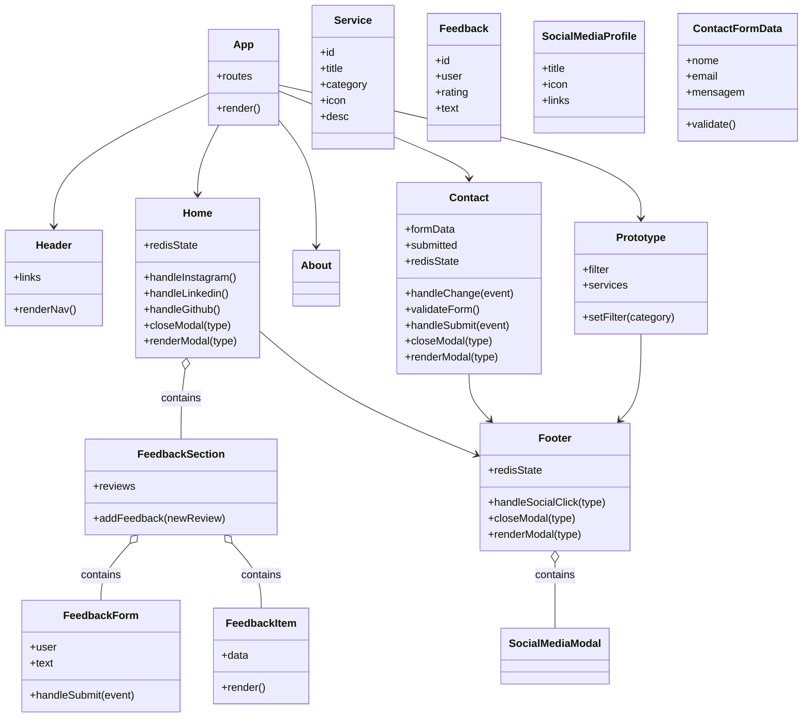

# Diagrama de Classes UML - Projeto Indra

## Principais classes 

- `App`
  - Atributos:
    - `routes`
  - Métodos:
    - `render()`
  - Relacionamentos:
    - Composição com `Header`
    - Associação com `Home`, `About`, `Contact`, `Prototype`

- `Header`
  - Atributos:
    - `links`
  - Métodos:
    - `renderNav()`
  - Relacionamentos:
    - Usa `Link` do React Router

- `Footer`
  - Atributos:
    - `redisState`
  - Métodos:
    - `handleSocialClick(type)`
    - `closeModal(type)`
    - `renderModal(type)`
  - Relacionamentos:
    - Composição com `SocialMediaModal`

- `Home`
  - Atributos:
    - `redisState`
  - Métodos:
    - `handleInstagram()`
    - `handleLinkedin()`
    - `handleGithub()`
    - `closeModal(type)`
    - `renderModal(type)`
  - Relacionamentos:
    - Composição com `FeedbackSection`
    - Associação com `Footer`

- `FeedbackSection`
  - Atributos:
    - `reviews`
  - Métodos:
    - `addFeedback(newReview)`
  - Relacionamentos:
    - Composição com `FeedbackForm`
    - Composição com `FeedbackItem`

- `FeedbackForm`
  - Atributos:
    - `user`
    - `text`
  - Métodos:
    - `handleSubmit(event)`
  - Relacionamentos:
    - Associação com `FeedbackSection` via prop `onAdd`

- `FeedbackItem`
  - Atributos:
    - `data` (`user`, `rating`, `text`)
  - Métodos:
    - `render()`

- `Contact`
  - Atributos:
    - `formData`
    - `submitted`
    - `redisState`
  - Métodos:
    - `handleChange(event)`
    - `validateForm()`
    - `handleSubmit(event)`
    - `closeModal(type)`
    - `renderModal(type)`
  - Relacionamentos:
    - Associação com `Footer`

- `Prototype`
  - Atributos:
    - `filter`
    - `services`
  - Métodos:
    - `setFilter(category)`
  - Relacionamentos:
    - Associação com `Footer`

- `Service` (domínio)
  - Atributos:
    - `id`
    - `title`
    - `category`
    - `icon`
    - `desc`

- `Feedback` (domínio)
  - Atributos:
    - `id`
    - `user`
    - `rating`
    - `text`

- `SocialMediaProfile` (domínio)
  - Atributos:
    - `title`
    - `icon`
    - `links`

- `ContactFormData` (domínio)
  - Atributos:
    - `nome`
    - `email`
    - `mensagem`
  - Métodos:
    - `validate()`

## Diagrama de classes (Mermaid)

### Resultado
- O diagrama mostra pelo menos 3 classes principais: `Home`, `FeedbackSection`, `Footer`.
- Os relacionamentos representam a estrutura real do projeto: `App` dirige as rotas, `Home` contém o feedback, e `Footer` exibe modais sociais.
- O texto explica os atributos e métodos mais relevantes para cada classe.
